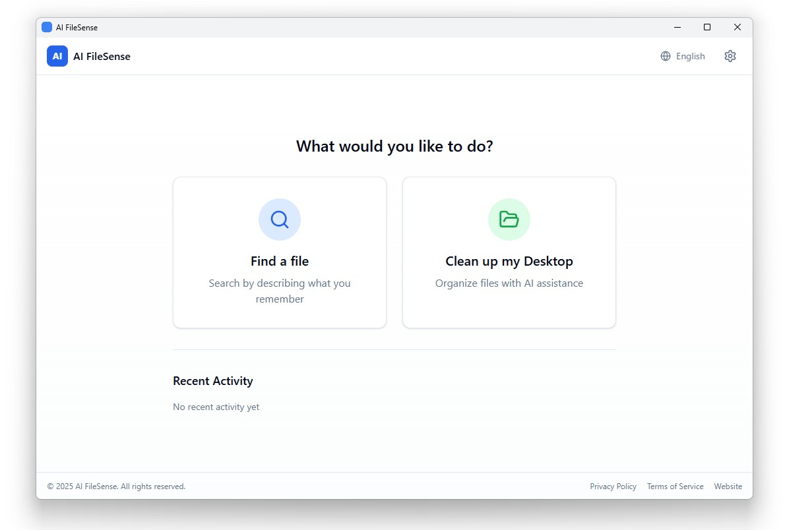

<div align="center">

# AI FileSense Website

### Marketing website for AI FileSense — the Windows desktop app that organizes your files locally using Claude AI.

[](https://aifilesense.com)
[](LICENSE)
[](https://www.typescriptlang.org/)
[](https://nextjs.org/)

[**Live Site**](https://aifilesense.com) · [**Features**](https://aifilesense.com/features) · [**Support**](https://aifilesense.com/support)



</div>

---

## Overview

This repository contains the marketing website for AI FileSense, a Windows desktop application that uses Claude AI to intelligently organize files and folders. The website serves as the product information hub with bilingual support (English and Spanish), documentation, FAQ, and support resources.

**Built for:** Windows users who want to organize their Desktop, Documents, and Downloads without uploading files to the cloud.

---

## Features

| Feature | Benefit |
|---------|---------|
| **Bilingual Support** | Full English and Spanish (Mexico) via locale-based routing |
| **Server Components** | Fast page loads with Next.js 14 App Router |
| **Contact System** | Form validation with Zod, email delivery via Resend |
| **SEO Optimized** | Dynamic metadata, Open Graph, auto-generated sitemap |
| **Accessible** | WCAG AA compliant, semantic HTML, keyboard navigation |
| **Dark Mode** | System preference detection with localStorage persistence |

---

## Tech Stack

- **Next.js 14** — App Router, Server Components, Server Actions
- **TypeScript** — Strict mode enabled
- **Tailwind CSS** — Utility-first styling with CSS variables
- **next-intl** — Internationalization (EN + ES-MX)
- **React Hook Form + Zod** — Form state and validation
- **Resend** — Transactional email delivery
- **Framer Motion** — Animations and transitions

---

## Quick Start

### Prerequisites

- **Node.js** 20+ (check: `node -v`)
- **npm** 8+ or equivalent package manager

### 1. Clone & Install

```powershell
git clone https://github.com/yourusername/ai-filesense-website.git
cd ai-filesense-website

npm install
```

### 2. Environment Setup

```powershell
# Create environment file
Copy-Item .env.example .env.local

# Edit with your values
notepad .env.local
```

Required variables:

```bash
# .env.local
SITE_URL=https://aifilesense.com

# Email (Resend)
RESEND_API_KEY=re_xxxxx
NOTIFICATION_EMAIL=support@aifilesense.com
CONTACT_FROM="AI FileSense <noreply@aifilesense.com>"
```

### 3. Start Development Server

```powershell
npm run dev
```

Open [http://localhost:3000](http://localhost:3000)

**Success indicator:** You should see the home page with the hero section and app screenshot.

---

## Project Structure

```
ai-filesense-website/
├── app/
│   ├── [locale]/              # Locale-based routing (en, es)
│   │   ├── layout.tsx         # Root layout with navbar/footer
│   │   ├── page.tsx           # Home page (hero, features, folders)
│   │   ├── features/          # Features, differentiators, roadmap
│   │   ├── download/          # Download page with system requirements
│   │   ├── pricing/           # Pricing tiers and API cost info
│   │   ├── support/           # Support hub
│   │   │   ├── faq/           # 10 FAQs
│   │   │   ├── getting-started/  # 8-step user journey
│   │   │   └── contact/       # Contact form
│   │   ├── privacy/           # Privacy policy
│   │   └── terms/             # Terms of service
│   ├── actions/               # Server actions (contact form)
│   ├── sitemap.ts             # Auto-generated sitemap
│   └── robots.ts              # Robots.txt configuration
├── components/
│   ├── ui/                    # Atomic components (button, card, input)
│   ├── layout/                # Layout components (navbar, footer)
│   ├── contact/               # Contact form with validation
│   ├── emails/                # React Email templates
│   └── icons/                 # SVG icon components
├── messages/
│   ├── en.json                # English translations
│   └── es.json                # Spanish translations
├── lib/
│   ├── schemas.ts             # Zod validation schemas
│   ├── seo.ts                 # SEO utilities
│   ├── mdx.ts                 # MDX processing
│   └── utils.ts               # cn() helper, formatDate()
├── public/
│   └── images/                # Static assets (hero, logos, blog)
└── styles/
    └── globals.css            # Tailwind config + CSS variables
```

---

## Available Scripts

| Command | Description |
|---------|-------------|
| `npm run dev` | Start development server on port 3000 |
| `npm run build` | Create production build |
| `npm start` | Run production server |
| `npm run check` | TypeScript + ESLint validation |
| `npm run typecheck` | TypeScript type checking only |
| `npm run lint` | ESLint validation only |
| `npm run format` | Format code with Prettier |

---

## Configuration

### Internationalization

Translations are stored in `/messages/*.json`. The app supports two locales:

- `en` — English (default)
- `es` — Spanish (Mexico)

**Server Components:**
```typescript
import { getTranslations } from 'next-intl/server'

const t = await getTranslations('home')
return <h1>{t('hero.title')}</h1>
```

**Client Components:**
```typescript
'use client'
import { useTranslations } from 'next-intl'

const t = useTranslations('nav')
return <span>{t('features')}</span>
```

### Component Variants

**Button:** `primary`, `secondary`, `outline`, `ghost`

```tsx
<Button variant="primary">Download Free</Button>
<Button variant="outline">Learn More</Button>
```

**Container:** `sm`, `md`, `lg`, `xl` (max-width)

```tsx
<Container size="lg">{children}</Container>
```

**Section:** `sm`, `md`, `lg`, `xl` (vertical padding)

```tsx
<Section spacing="lg">{children}</Section>
```

---

## Content Structure

### 11 Smart Folders

The product organizes files into `Documents/Organized Files/` with numbered folders:

| # | Folder | Contents |
|---|--------|----------|
| 01 | Work | Resumes, job offers, payslips, employment contracts |
| 02 | Personal | Personal correspondence, family documents, life admin |
| 03 | Financial | Bank statements, tax returns, invoices, budgets |
| 04 | Medical | Medical records, prescriptions, lab results |
| 05 | Legal | Contracts, licenses, IDs, passports |
| 06 | Education | Certificates, transcripts, course materials |
| 07 | Creative | Design files, writing projects, artwork |
| 08 | Technical | Code docs, technical specs, system guides |
| 09 | Reference | Manuals, how-to guides, saved articles |
| 10 | Archive | Older documents, completed projects |
| 11 | Review | Low-confidence items for manual sorting |

### Page Content

| Page | Key Content |
|------|-------------|
| Home | Hero, 3-step process, 6 features, 11 folders, CTA |
| Features | 8-step user journey, 6 differentiators, file types, roadmap |
| Support/FAQ | 11 questions covering data safety, undo, file types, no config |
| Support/Getting Started | 8-step user journey with tips |

---

## Deployment

### Vercel (Recommended)

```powershell
# Install Vercel CLI
npm i -g vercel

# Deploy
vercel --prod
```

Set environment variables in Vercel dashboard:
- `SITE_URL`
- `RESEND_API_KEY`
- `NOTIFICATION_EMAIL`
- `CONTACT_FROM`

### Manual Build

```powershell
npm run build
npm start
```

Production server runs on port 3000 by default.

---

## Environment Variables

| Variable | Required | Description |
|----------|----------|-------------|
| `SITE_URL` | Yes | Production URL for SEO and sitemap |
| `RESEND_API_KEY` | Yes | Resend API key for email delivery |
| `NOTIFICATION_EMAIL` | Yes | Email address for contact form submissions |
| `CONTACT_FROM` | Yes | From address for outgoing emails |

---

## Code Conventions

- **Imports:** Use `@/` alias for absolute imports
- **TypeScript:** Strict mode — no implicit any
- **Exports:** Prefer named exports
- **Styling:** Use `cn()` for conditional Tailwind classes
- **Responsive:** Mobile-first design approach
- **Accessibility:** Semantic HTML, ARIA labels where needed

### Pre-Commit Checklist

```powershell
npm run check
```

Validates TypeScript types and ESLint rules. Must pass before committing.

---

## License

Educational Use License — see [LICENSE](./LICENSE) for details.

Commercial use requires prior written permission from the copyright holder.

---

## Support

- **Documentation:** [aifilesense.com/support](https://aifilesense.com/support)
- **FAQ:** [aifilesense.com/support/faq](https://aifilesense.com/support/faq)
- **Contact:** [aifilesense.com/contact](https://aifilesense.com/contact)

---

<div align="center">

**Built by [Robert Cushman](https://cushlabs.ai) | [CushLabs.ai](https://cushlabs.ai)**

</div>
